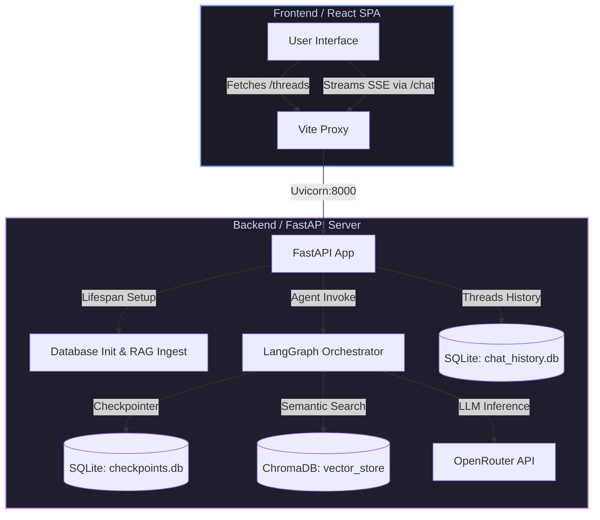

# 🌌 Zerostic JAI 2.0 — Enterprise Sales Agent Platform

JAI 2.0 is Zerostic's next-generation AI-powered sales orchestrator platform. Designed to interact with potential clients, partners, and visitors, JAI introduces an elegant, multi-tenant conversational interface that acts as the primary digital representative for Zerostic's suite of proprietary products and custom digital services.

This repository is organized as a monorepo split into two primary components:
1. **`frontend/`**: A highly polished, responsive React + TypeScript Single Page Application (SPA) powered by Vite, boasting custom styled Vanilla CSS transitions and an immersive aurora theme.
2. **`backend/`**: A robust, state-of-the-art Python agent engine using FastAPI, LangGraph orchestrators, ChromaDB for RAG context extraction, SQLite for session checkpoints, and OpenRouter for LLM inference.

---

## ⚡ Quick Start: Running the Entire App

Follow these side-by-side instructions to get both the backend server and frontend client running in under 5 minutes.

### 🔌 Step 1: Start the Backend Server
First, configure your API keys and start the FastAPI engine.

```bash
# Navigate to the backend directory
cd backend

# Create and activate a Python virtual environment (Python >= 3.11)
python -m venv .venv
source .venv/bin/activate   # On Windows: .venv\Scripts\activate

# Install all backend requirements
pip install -r requirements.txt

# Create your environment file from the template
cp .env.example .env
```

> [!IMPORTANT]
> Edit the `.env` file to add your `OPENROUTER_API_KEY`. JAI relies on OpenRouter to serve its core LLM orchestrator.

```bash
# Launch the backend server
python -m uvicorn api:app --reload --port 8000
```
The server will initialize SQLite schemas, ingest local docs from `docs/` into ChromaDB for RAG, and start listening at **`http://localhost:8000`**.

---

### 💻 Step 2: Start the Frontend Client
In a new terminal window, spin up the Vite development server.

```bash
# Navigate to the frontend directory
cd frontend

# Install client-side dependencies
npm install

# Launch the Vite development server
npm run dev
```
The client will start running at **`http://localhost:5173`**. The Vite server has a built-in proxy that routes all `/chat`, `/threads`, and `/health` requests directly to your running backend at port `8000`.

---

## 🏗️ System Architecture



### Key Technical Specs

| Layer | Technology | Primary Role / Purpose |
|---|---|---|
| **Frontend Core** | React 18 & TypeScript | Type-safe, dynamic user interactions and component management. |
| **Frontend Styling** | Custom Vanilla CSS | Glassmorphism, smooth CSS-based responsive drawer, and aurora animations. |
| **API Server** | FastAPI & Uvicorn | High-performance async Python backend supporting Server-Sent Events (SSE) streaming. |
| **Agent Logic** | LangGraph & LangChain | Stateful multi-agent orchestrator with custom guards, tool routing, and constraints. |
| **Vector Store** | ChromaDB & SentenceTransformers | Local RAG vector indexing of documentation files in `backend/docs/`. |
| **State Databases** | SQLite (`aio-sqlite`) | Lightweight, zero-config relational storage for thread histories and LangGraph checkpointers. |
| **LLM Provider** | OpenRouter AI Gateway | Unified access to state-of-the-art open-weights and proprietary models (e.g. Llama-3). |

---

## 📂 Repository Layout

```text
Zerostic/
├── frontend/               # React + TypeScript client-side code
│   ├── src/                # App source code (Components, Hooks, Types, CSS)
│   ├── index.html          # HTML entry point
│   ├── vite.config.ts      # Vite bundler, proxy configuration & vitest specs
│   └── package.json        # Frontend scripts and dependencies
│
├── backend/                # Python + LangGraph server-side code
│   ├── agents/             # LangGraph agent definitions & orchestrator builds
│   ├── rag/                # Ingestion scripts for vector embeddings
│   ├── docs/               # Local markdown/txt docs ingested for RAG
│   ├── tools/              # Agent tools (web search, custom API tools, etc.)
│   ├── api.py              # FastAPI endpoints & lifespan (db/RAG auto-init)
│   ├── main.py             # Offline interactive terminal interface
│   ├── pyproject.toml      # Setuptools packaging config
│   ├── requirements.txt    # Python dependencies
│   ├── checkpoints.db      # SQLite db for LangGraph checkpoints (Git ignored)
│   └── chat_history.db     # SQLite db for Thread list records (Git ignored)
│
└── README.md               # Main repository documentation
```

---

## 💡 Subdirectory Documentation

For deeper insight, configurations, and advanced features of each component, check out the specialized guides in their respective folders:

*   **[Frontend Documentation](file:///run/media/yash/New%20Volume/IIITH/Internship/Zerostic/frontend/README.md)**: Deep dive into the client architecture, custom styled hook integrations (`useChat`), design systems, and Vitest test specs.
*   **[Backend Documentation](file:///run/media/yash/New%20Volume/IIITH/Internship/Zerostic/backend/README.md)**: Detailed breakdown of the LangGraph agent state machines, database persistence, RAG pipeline, API references, and open-weights parameters.

---

## 📄 License & Ownership
Copyright © 2026 **Zerostic** (zerostic.com). All rights reserved. Managed under strict alignment manuals for JAI.
