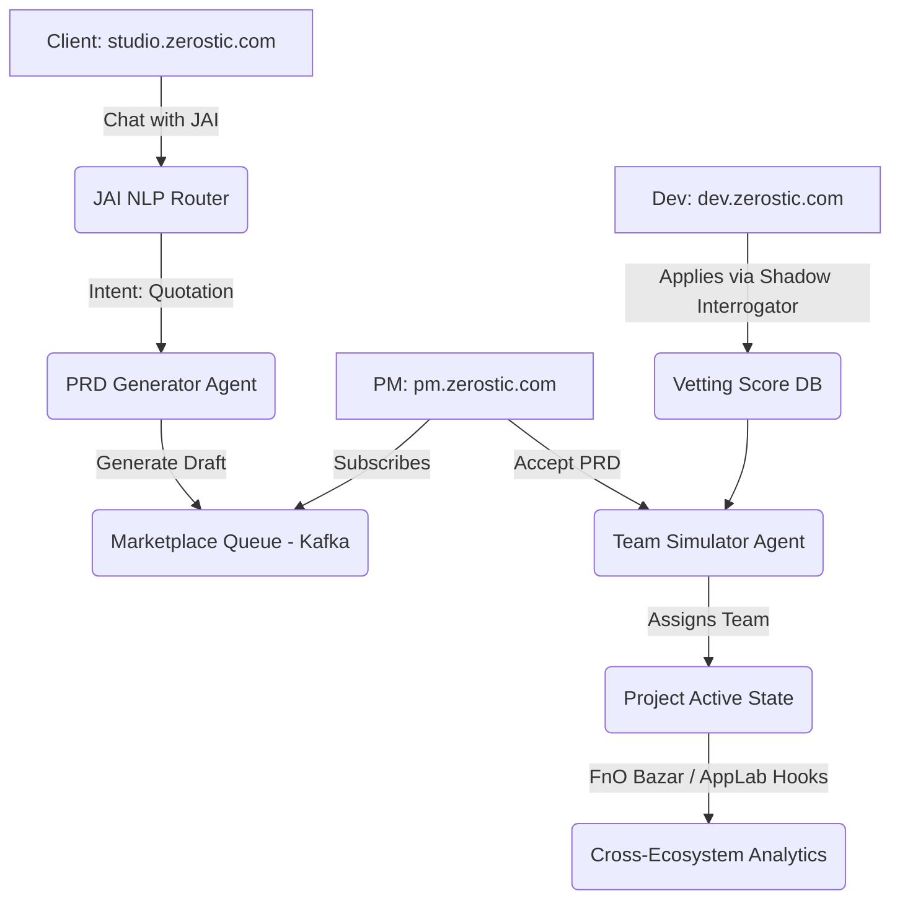

# Predictive Marketplace Architecture

## Multi-Tenant Routing Architecture
Since the marketplace logic is decentralized, we architect the frontend to use isolated subdomains backed by a unified graph database.

- **Client Portal:** `studio.zerostic.com` (Already exists)
- **PM Portal:** `pm.zerostic.com` (Predictive)
- **Developer Sandbox:** `dev.zerostic.com` (Predictive)

## State Machine & Framework Logic (Mermaid)

## Agentic Framework Stack
- **Orchestration:** LangGraph to manage cyclical vetting states and JAI’s state machine.
- **Tools Execution:** MCP (Model Context Protocol) via Playwright instances to enable JAI to physically click and test deployed environments.
- **LLM Pipeline:** DeepSeek/Llama-3 via OpenRouter for high-throughput reasoning, with a custom fine-tuned model for strict PRD generation constraints.
